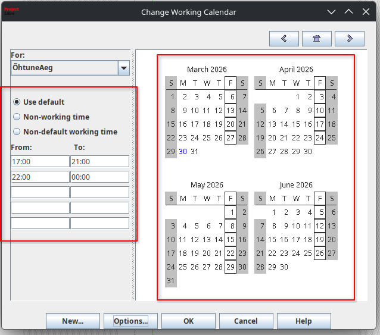

# ProjectLibre Õpetusveeb

See projekt on loodud eesmärgiga pakkuda kasutajatele selget ja visuaalset juhist tarkvara ProjectLibre kasutamiseks. Veebileht keskendub kahele peamisele teemale: uue kalendri loomine ja erinevate diagrammide (Gantt, WBS, Network) kasutamine.

---

## Sisukord
1. [Projekti kirjeldus](#projekti-kirjeldus)
2. [Tehtud tööd](#tehtud-tööd)
3. [Kasutatud tehnoloogiad](#kasutatud-tehnoloogiad)
4. [Lehekülgede struktuur](#lehekülgede-struktuur)
5. [Visuaalid](#visuaalid)

---

## Projekti kirjeldus
Projekti raames on arendatud veebileht, mis selgitab samm-sammult ProjectLibre [^1] põhifunktsioone. Design on moderne, hästi loetav ja toetab interaktiivset piltide sirvimist.

> [!NOTE]
> ProjectLibre on tasuta avatud lähtekoodiga alternatiiv Microsoft Projectile.

---

## Tehtud tööd

Allpool on toodud ProjectLibre haru raames teostatud ülesanded:

### Lõpetatud ülesanded
- [x] **ProjectLibre õpetuslehe loomine**: Veebilehe kohandamine spetsiaalselt ProjectLibre tarkvarale.
- [x] **Kalendri loomise juhend**: `index.html` sisu koostamine ProjectLibre ekraanitõmmistega.
- [x] **Diagrammide loomise juhend**: `diagramm.html` sisu (Gantt, WBS, Network diagrammid).
- [ ] **Interaktiivne menüü**: Navigeerimine ainult ProjectLibre asjakohaste lehtede vahel.
- [ ] **Pildid**: Kõik ekraanitõmmised on teostatud ProjectLibre tarkvara tööaknast.
- [ ] `valem.html` on eemaldatud.

> [!WARNING]
> Enne faile üles panemist veendu, et kõik pildid on olemas kataloogis `images/`, sealhulgas projektile spetsiifilised ekraanitõmmised.

---

## Kasutatud tehnoloogiad
| Tehnoloogia | Kasutusvaldkond |
| :--- | :--- |
| **HTML5** | Sisu ja struktuur |
| **CSS3** | Stiil ja animatsioonid |
| **JS** | Lightbox ja kerimisinteraktsioonid |
| **ProjectLibre** | Algne tarkvara juhiste loomiseks |

---

## Lehekülgede struktuur
| Fail | Kirjeldus |
| :--- | :--- |
| `index.html` | Uue kalendri loomine ProjectLibre's |
| `diagramm.html` | Projekti visualiseerimine (Gantt jne) |
| `style.css` | Kujundusfail |

---

## Visuaalid
Siin on näide ProjectLibre kalendri seadetest:

*Joonis 1: ProjectLibre "Change Working Calendar" aken.*

---

## Lingid ja viited
- [ProjectLibre ametlik koduleht](https://www.projectlibre.com/)
- [ProjectLibre Download](https://sourceforge.net/projects/projectlibre/)
- [GitHub Pages Docs](https://docs.github.com/en/pages)

> [!TIP]
> ProjectLibre'i kasutades kasuta paremklõpsu tabeli päisel, et kiiresti vahetada vaateid või lisada veerge.

> [!IMPORTANT]
> ProjectLibre's uut kalendrit luues veendu, et oled valinud õige "Base Calendar" (tavaliselt Standard), mille põhjal koopiat teha!

[^1]: Kasutatud on ProjectLibre versiooni 1.9.3.